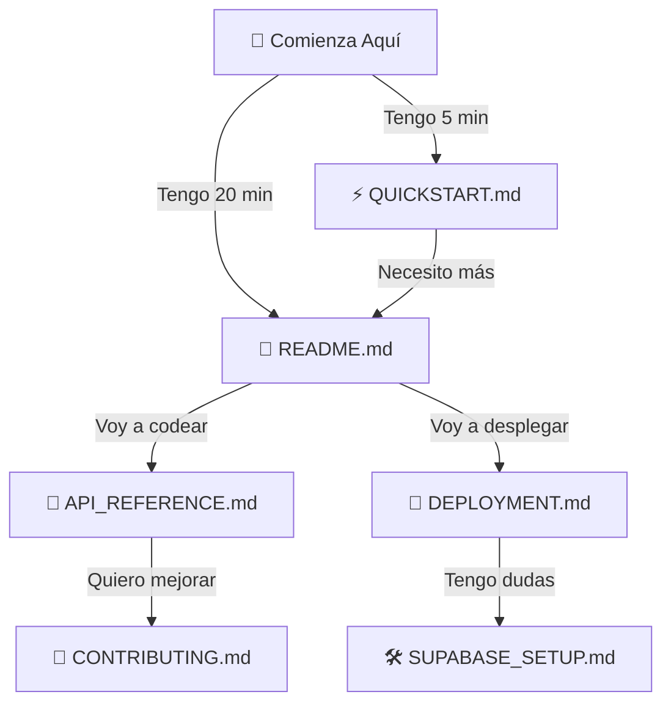

# 📚 Tesoros del Barrio - Índice de Documentación

Bienvenido a **Tesoros del Barrio**, una aplicación web completa para descubrir y compartir lugares interesantes de tu barrio.

## 🎯 Comienza Aquí

### ⚡ Tienes 5 minutos?
→ Lee [**QUICKSTART.md**](QUICKSTART.md)
- Instalación rápida
- Primeros pasos
- Solución de problemas básicos

### 📖 Quieres aprender todo?
→ Lee [**README.md**](README.md)
- Guía completa
- Características detalladas
- Instalación completa
- Despliegue

### 🛠️ Necesitas configurar Supabase?
→ Lee [**SUPABASE_SETUP.md**](SUPABASE_SETUP.md)
- Crear proyecto
- Configurar tablas
- Crear storage
- Verificar configuración

---

## 📂 Estructura de Documentación

```
Documentación Principal
├── README.md                    ⭐ Guía principal completa
├── QUICKSTART.md               ⚡ Inicio en 5 minutos
├── PROJECT_OVERVIEW.md         📚 Resumen del proyecto
├── SUPABASE_SETUP.md           🛠️ Configuración de BD
├── DEPLOYMENT.md               🚀 Despliegue en producción
├── API_REFERENCE.md            📖 Referencia de API
├── CONTRIBUTING.md             🤝 Cómo contribuir
├── CHANGELOG.md                📝 Historial de versiones
└── LICENSE                     📄 Licencia MIT
```

---

## 🗺️ Mapa de Documentación

Selecciona tu rol para encontrar los documentos relevantes:

### 👤 **Soy Usuario Final**
```
Quiero usar la aplicación
│
├─ ⚡ QUICKSTART.md (5 min)
├─ 📖 README.md (secciones de uso)
└─ 🐛 Solución de problemas en README.md
```

### 👨‍💻 **Soy Desarrollador**
```
Quiero instalar y desarrollar localmente
│
├─ ⚡ QUICKSTART.md (instalación)
├─ 📖 README.md (arquitectura)
├─ 🛠️ SUPABASE_SETUP.md (BD)
├─ 📚 PROJECT_OVERVIEW.md (visión general)
└─ 📖 API_REFERENCE.md (uso de módulos)
```

### 🚀 **Soy DevOps/SRE**
```
Quiero desplegar a producción
│
├─ 📖 README.md (requisitos)
├─ 🚀 DEPLOYMENT.md (todas las opciones)
├─ 🐳 Dockerfile (contenedor)
└─ 🛠️ SUPABASE_SETUP.md (BD)
```

### 🤝 **Quiero Contribuir**
```
Quiero contribuir al proyecto
│
├─ 🤝 CONTRIBUTING.md (cómo contribuir)
├─ 📖 API_REFERENCE.md (entender código)
├─ 📚 PROJECT_OVERVIEW.md (arquitectura)
└─ 📝 CHANGELOG.md (versiones)
```

---

## 📖 Guías por Tópico

### Instalación y Configuración

| Documento | Propósito | Duración |
|-----------|-----------|----------|
| [QUICKSTART.md](QUICKSTART.md) | Instalación rápida | 5 min |
| [README.md](README.md) | Instalación completa | 20 min |
| [SUPABASE_SETUP.md](SUPABASE_SETUP.md) | Configurar BD | 10 min |

### Desarrollo

| Documento | Propósito | Nivel |
|-----------|-----------|-------|
| [API_REFERENCE.md](API_REFERENCE.md) | Documentación de módulos | Intermedio |
| [PROJECT_OVERVIEW.md](PROJECT_OVERVIEW.md) | Arquitectura general | Intermedio |
| [README.md](README.md) | Estructura del proyecto | Principiante |

### Despliegue y DevOps

| Documento | Plataforma | Dificultad |
|-----------|-----------|-----------|
| [DEPLOYMENT.md](DEPLOYMENT.md) | Todas (Streamlit Cloud, Heroku, Docker, etc.) | Intermedio |
| Dockerfile | Docker | Intermedio |
| Procfile | Heroku | Fácil |
| [README.md](README.md) | Información general | Fácil |

### Contribuciones

| Documento | Propósito |
|-----------|-----------|
| [CONTRIBUTING.md](CONTRIBUTING.md) | Cómo contribuir |
| [CHANGELOG.md](CHANGELOG.md) | Historial y roadmap |
| [API_REFERENCE.md](API_REFERENCE.md) | Entender el código |

---

## 🚀 Flujos de Trabajo Comunes

### 1️⃣ "Quiero empezar ahora mismo"
```
1. Lee QUICKSTART.md (5 min)
2. Copia .env.example a .env
3. Completa credenciales de Supabase
4. Ejecuta setup.sql en Supabase
5. Ejecuta rls.sql en Supabase
6. Crea bucket lugares-fotos
7. streamlit run app.py
8. ¡Listo! Registrate y prueba
```

### 2️⃣ "Quiero entender cómo funciona"
```
1. Lee README.md
2. Lee PROJECT_OVERVIEW.md
3. Explora API_REFERENCE.md
4. Revisa el código con comentarios
5. Ejecuta la app localmente
6. Experimenta con los módulos
```

### 3️⃣ "Quiero desplegar a producción"
```
1. Lee DEPLOYMENT.md
2. Elige tu plataforma
3. Sigue las instrucciones específicas
4. Configura variables de entorno
5. Verifica funcionamiento
6. Monitorea la aplicación
```

### 4️⃣ "Quiero contribuir código"
```
1. Lee CONTRIBUTING.md
2. Lee API_REFERENCE.md
3. Fork el repositorio
4. Crea una rama feature
5. Haz cambios
6. Prueba localmente
7. Envía Pull Request
```

---

## 📊 Resumen Rápido

### Arquitectura
- **Backend:** Python + Streamlit
- **BD:** PostgreSQL (Supabase)
- **Auth:** Supabase Auth
- **Storage:** Supabase Storage
- **Mapas:** Folium

### Tablas de BD
- `usuarios` - Perfiles de usuarios
- `lugares` - Lugares compartidos
- `logs_actividad` - Auditoría

### Módulos Python
- `app.py` - Aplicación principal
- `utils/auth.py` - Autenticación
- `utils/places.py` - Gestión de lugares
- `utils/supabase_client.py` - Cliente de Supabase

### Archivos de Configuración
- `.env` - Variables de entorno (no en Git)
- `.streamlit/config.toml` - Config de Streamlit
- `Dockerfile` - Contenedor Docker
- `requirements.txt` - Dependencias Python

---

## 🎓 Niveles de Complejidad

### 🟢 Principiante
- Usar la aplicación
- Instalar localmente
- Leer documentación básica

**Documentos:** QUICKSTART.md, README.md (secciones uso)

### 🟡 Intermedio
- Entender arquitectura
- Hacer cambios simples
- Desplegar a producción

**Documentos:** API_REFERENCE.md, DEPLOYMENT.md, PROJECT_OVERVIEW.md

### 🔴 Avanzado
- Modificar flujos complejos
- Agregar nuevas features
- Optimizar rendimiento

**Documentos:** API_REFERENCE.md, CONTRIBUTING.md, revisar código

---

## ✅ Checklist por Caso de Uso

### Instalación Local
- [ ] Leer QUICKSTART.md
- [ ] Descargar proyecto
- [ ] Crear entorno virtual
- [ ] Instalar dependencias
- [ ] Configurar .env
- [ ] Crear proyecto Supabase
- [ ] Ejecutar SQL
- [ ] Crear bucket
- [ ] Ejecutar app

### Primeros Pasos
- [ ] Registrarse
- [ ] Agregar lugar
- [ ] Ver en mapa
- [ ] Editar lugar
- [ ] Eliminar lugar
- [ ] Explorar otros lugares

### Despliegue
- [ ] Elegir plataforma
- [ ] Preparar código
- [ ] Configurar secretos
- [ ] Desplegar
- [ ] Verificar funcionamiento
- [ ] Monitorear logs

---

## 🔍 Búsqueda Rápida

¿Buscas algo específico?

### Errores Comunes
→ Ver sección en README.md y SUPABASE_SETUP.md

### Cómo instalar
→ QUICKSTART.md o README.md

### Cómo desplegar
→ DEPLOYMENT.md

### Cómo contribuir
→ CONTRIBUTING.md

### Cómo usar la API
→ API_REFERENCE.md

### Roadmap futuro
→ CHANGELOG.md

### Licencia
→ LICENSE (MIT)

---

## 📱 Formatos Disponibles

Toda la documentación está disponible en:
- ✅ Markdown (.md)
- ✅ Visualización en GitHub
- ✅ Markdown viewers (VS Code, etc.)

---

## 🔗 Enlaces Rápidos

### Archivo Principal
- [README.md](README.md) - Guía completa (⭐ COMIENZA AQUÍ)

### Para Apurados
- [QUICKSTART.md](QUICKSTART.md) - 5 minutos

### Para Técnicos
- [API_REFERENCE.md](API_REFERENCE.md) - Referencia de módulos
- [PROJECT_OVERVIEW.md](PROJECT_OVERVIEW.md) - Arquitectura

### Para DevOps
- [DEPLOYMENT.md](DEPLOYMENT.md) - Todas las opciones
- [SUPABASE_SETUP.md](SUPABASE_SETUP.md) - Configuración BD

### Para Colaboradores
- [CONTRIBUTING.md](CONTRIBUTING.md) - Cómo contribuir
- [CHANGELOG.md](CHANGELOG.md) - Versiones y roadmap

---

## 📞 Ayuda Rápida

### "¿Por dónde empiezo?"
→ [QUICKSTART.md](QUICKSTART.md) (5 minutos)

### "No entiendo cómo instalar"
→ [README.md](README.md) (sección Instalación)

### "¿Cómo configuro Supabase?"
→ [SUPABASE_SETUP.md](SUPABASE_SETUP.md)

### "Quiero desplegar a producción"
→ [DEPLOYMENT.md](DEPLOYMENT.md)

### "¿Cómo uso los módulos?"
→ [API_REFERENCE.md](API_REFERENCE.md)

### "¿Cómo contribuyo?"
→ [CONTRIBUTING.md](CONTRIBUTING.md)

### "¿Qué ha cambiado?"
→ [CHANGELOG.md](CHANGELOG.md)

---

## 🎯 Próximos Pasos



---

## 📊 Información del Proyecto

| Aspecto | Detalle |
|--------|---------|
| **Nombre** | Tesoros del Barrio |
| **Versión** | 1.0.0 |
| **Estado** | ✅ Producción |
| **Licencia** | MIT |
| **Lenguaje** | Python |
| **Framework** | Streamlit |
| **BD** | PostgreSQL (Supabase) |
| **Documentación** | Completa (10+ archivos) |

---

## 🎓 Recursos Externos

- 📚 [Documentación Streamlit](https://docs.streamlit.io)
- 🚀 [Documentación Supabase](https://supabase.com/docs)
- 🗺️ [Documentación Folium](https://python-visualization.github.io/folium/)
- 🐍 [Documentación Python](https://docs.python.org/3/)

---

## 🎉 ¡Bienvenido!

Tesoros del Barrio es una aplicación **lista para usar**, **bien documentada** y **lista para producción**.

**¿Dónde empezar?**

1. **Rápido (5 min):** [QUICKSTART.md](QUICKSTART.md)
2. **Completo (20 min):** [README.md](README.md)
3. **Profundo:** [PROJECT_OVERVIEW.md](PROJECT_OVERVIEW.md)

---

**Última actualización:** 2024  
**Mantenedor:** Desarrollador Senior  
**Comunidad:** ¡Contribuciones bienvenidas!

¡Disfruta descubriendo los tesoros de tu barrio! 🌟🗺️
